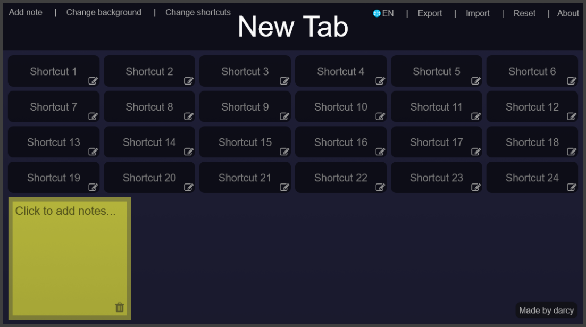
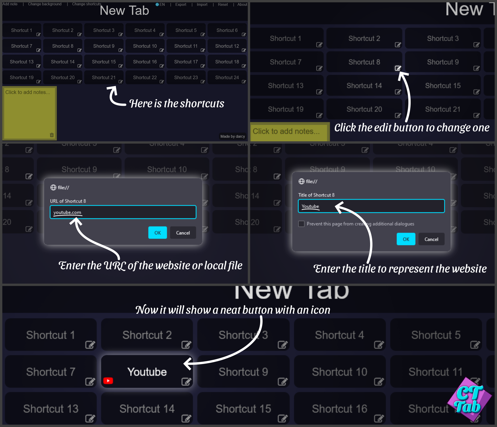
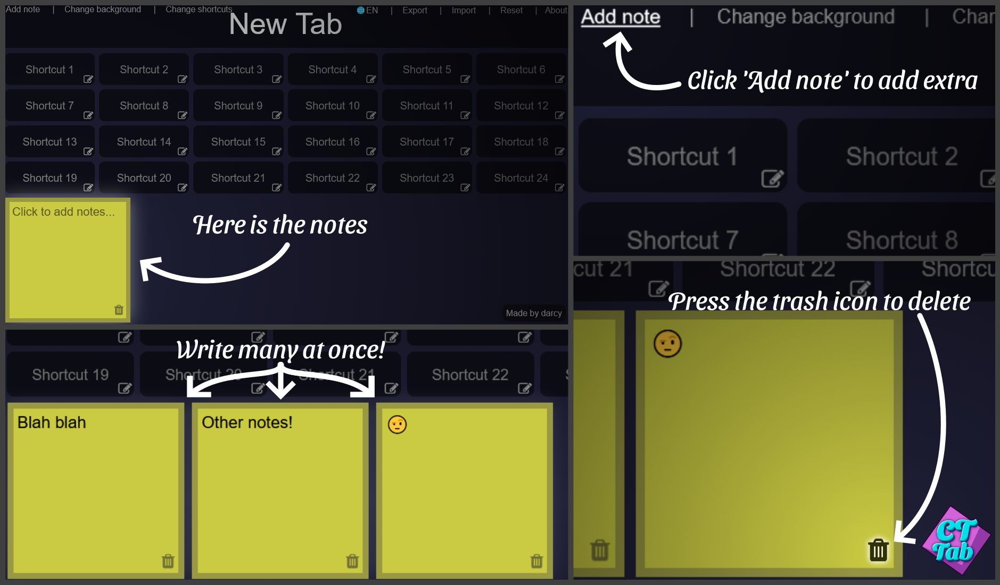

# CTTab

The easiest Custom New Tab page for the browser!

The '_CT_' in the name stands for '_Custom Tab_' :)

**Check it out**: [CTTab Website](https://dxrcy.github.io/cttab)

Works on Firefox, Chrome, and possibly more!



# Contents

-   [Features](#features) - Explains the Awesome Features!
-   [Setup](#setup) - How to set up on browser
-   [Contributing](#contributing) - How to contribute to the project
-   [Issues](#issues) - How to submit an issue

# Features

## Shortcuts

Fully customizable shortcuts to commonly visited sites!

-   Click the Edit button to change the link and title of each shortcut
-   Remove by entering blank text into the URL input box
-   Icon will automatically be fetched
-   Change the amount of shortcuts shown in the top bar '_Change shortcuts_'



Class: `sc` (`sc.js`)

## Quick Notes

Easy notepads for taking short notes in an instant!

-   Create a new note in the top bar '_Add note_'
-   Type some text
-   Create multiple notes at once!
-   Delete the note with the trash icon



Class: `notes` (`main.js`)

## Custom Background Colour & Image

Create any sort of dynamic background, with random colours and images!

-   Open the background editor in the top bar '_Change background_'
-   Choose how to change the background

Class: `bg` (`bg.js`)

### Background Guide

#### Reset all (`0`)

Change all the background to default solid colour `#202038`

#### Solid colour (Or background of transparent image) (`1`)

-   Change the solid background color
-   If an image is enabled with a transparent background, the colour will be the background
-   Add any CSS compatible colour, hex codes (`#XXXXXX`), rgb (`rgb(xx, xx, xx)`), or hsl (`hsl(xx, xx, xx)`, **NOT** `hsv`),
-   Add `$` to represent default colour
-   Add multiple colours by seperating by space - Colour will be chosen randomly each load
-   Add randomly generated colour with `?`
    -   Any text after the `?` will be used as parameters for generated colours, as follows:
    -   To change the HSV requirements, use `a=n`, `a<n`, `a>n` syntax, with `a` being a letter of `h` (hue), `s` (saturation), or `v` (value), and `n` being a number between `0-360` for hue, or `0-100` for saturation and value
    -   To change the weight (chance) of the generated colour being chosen, use `w=n` or `W=n` with `n` being a number from `0-Infinity` - `w` (Lowercase) represents weight relative to the amount of other colours given, whereas `W` (Uppercase) represents absolute weight

Eg. `red #F0F $ rgb(50, 200, 100) ? s>50 v=100 W0.5`

This represents the following:

-   `50%` chance of getting a random colour (`W0.5` - Absolute weight)
-   Generated colour saturation will be greater than `50%` (`s>50`)
-   Generated colour value (lightness) will be `100%` always (`v=100`)
-   Non-generated colours will be randomly selected between:
    -   `red` - (`#F00`)
    -   `#F0F` - Magenta (`magenta`)
    -   `$` - Default colour - Grey blue (`#202038`)
    -   `rgb(50, 200, 100)` - Light green (`#32C864`)
-   Note that `rgb(50, 200, 100)` is parsed as one colour, even if it includes spaces

**`hsv` and `hsl` support coming soon! Maybe!**

#### Local or online image (`2`)

Add the URL of multiple local image files, or online links to images, separated by a space.

Eg. `C:/Desktop/troll_face.jpg https://dxrcy.github.io/cttab/image/icon/256.png $`

To use _Image of the Day_ from the _NASA API_, set the background image to `$`, and it will be automatically fetched. Use 'Image Info' button above footer to view the description.

#### Copy current colour (`3`)

If you like a randomly generated colour, you can use this option to select the current background colour (Also works with custom colours)

## Custom Title & Header

Change the Header bar and the Title (Seen in Tabs, Bookmarks, ect.)!

-   Click the header to edit, very easy and simple!

Class: `header` (`main.js`)

## Confetti

Instant confetti celebration with one simple click!

This is a secret feature, can you find it?
<span style="font-size: 30%; opacity: 0.3; line-height: 0">
It is also available through console commands, if you are a little baby.
</span>

Class: `confettiHandler` (`main.js`) (object `confetti` is the imported API)

## Import & Export Settings

Save and load settings to a JSON file on your computer! Back up your shortcuts!

-   Export settings and save to `cttab.json` in the top bar '_Export_'
-   Import settings from a file in the top bar '_Import_'
-   Settings are saved to `localStorage`

Class: `ls` (`ls.js`)

## Change Language

Choose between **TWO** languages! (English and Esperanto)

If you can translate into more languages, please consider [contributing](#contributing) to to this project!

Class: `language` (**NOT** `lang`) (`language.js`)

## Garfield

Choose the API URL for the random Garfield comic.

Date is chosen automatically, and substituted into url with `{YYYY}`, `{MM}`, and `{DD}` string variables.

See [EveryGarf Comic Downloader](https://github.com/dxrcy/everygarf) for information on downloading Garfield comics.

- `$` - Use default API ([gocomics.com](https://www.gocomics.com/garfield/1978/6/19))
- Example of online link: `https://dxrcy.github.com/garfield/comic/{YYYY}-{MM}-{DD}.png`
- Example of local link: `file:///home/gangstaperson/Pictures/garfield/{YYYY}-{MM}-{DD}.png`

Type `garf.showRecent()` in the terminal to show dates of recent comics!

# Setup

If you run into any problems, [Submit an Issue](#issues) for this repo and I will try to help.

## Downloading files

-   Download options:
    -   [Bash](#bash) (Linux)
    -   [Powershell](#powershell) (Windows)
    -   [Manually](#download-manually)

### Bash

Make sure you have [Git](https://git-scm.com/downloads) installed.

```bash
# Navigate to desired location - Example as Documents folder
cd ~/Documents

# Clone repository as ./cttab folder in current location, navigate into folder
git clone https://github.com/dxrcy/cttab.git
cd cttab

# Delete GitHub files
# OPTIONAL - Only do this if you have no interest of making changes to the files
rm -rf .git

# Open file in default program
xdg-open index.html
```

### Powershell

Make sure you have [Git](https://git-scm.com/downloads) installed.

```powershell
# Navigate to desired location - Example as Documents folder
cd C:/Users/$env:UserName/Documents

# Clone repository as ./cttab folder in current location, navigate into folder
git clone https://github.com/dxrcy/cttab.git
cd cttab

# Delete GitHub files
# OPTIONAL - Only do this if you have no interest of making changes to the files
rm -Recurse -Force .git

# Open file in default program
start index.html
```

Follow the steps below to open automatically (Below manual download)

### Download Manually

This has been tested in Windows 10, but it should work with systems.

1. Open a browser to [https://github.com/dxrcy/cttab](https://github.com/dxrcy/cttab)
2. Click the bright green 'Code' button
3. Click 'Download ZIP'
4. Save to a location on your computer
5. Once downloaded, right click on the `.zip` foler in Explorer and click 'Extract All...'
6. Click 'Extract' in the popup
7. Open the extracted folder and find `index.html`
8. That is the location to the file! You can open it in the browser, or follow the steps below to open automatically

## Firefox ⭐

These methods also work with Firefox forks such as LibreWolf.

### Open in new window ⭐

1. Open Firefox and click the ☰ hamburger icon in the top right
2. Click 'Options' from the drop-down menu
3. Select 'Home' on the left panel
4. Beside 'Homepage and new windows', select 'Custom URLs' from the list.
5. Input 'https://dxrcy.github.io/cttab' in the text box

### Open on new tab (Online)

Easier option, but less easy to use long term.

1. Download '[New Tab Redirect](https://addons.mozilla.org/en-US/firefox/addon/custom-new-tab-page/)' from Firefox addons
2. Click the ☰ hamburger icon in the top right
3. Press 'Addons and Themes' from the drop-down menu
4. Find and click 'Custom New Tab Page' from the list
5. Click 'Options' on the top bar under the name
6. Input 'https://dxrcy.github.io/cttab' in the text box
7. Scroll down and press 'Save'

### Open on new tab (Offline) ⭐

#### Linux

Easy!

Simply run `sh ./install firefox` or `sh ./install librewolf`

This will automate the steps shown below.

#### Windows, or manual Linux

Difficult to set up, but the optimal option overall.

> Note: Copy/pasting of files is done because of Windows' weird permission system.
> 
> Linux users can avoid this by running as root (or installing automatically [as shown above](#linux))

1. [Follow instructions to download files](#downloading-files)
2. Create a text file one your Desktop and name it `autoconfig.cfg`
3. Insert this code:

```
// First line must be comment! Do not delete this line!
var {classes:Cc,interfaces:Ci,utils:Cu} = Components;
try { Cu.import("resource:///modules/AboutNewTab.jsm");
var newTabURL = "file:///C:/Users/yourname/yourfile.html";
AboutNewTab.newTabURL = newTabURL;
} catch(e){Cu.reportError(e);} // report errors in the Browser Console
```

4. Replace `file:///C:/Users/yourname/yourfile.html` with the path to the local file. Example: `file:///C:/Users/gangstaperson/Documents/cttab/index.html`
5. Save the file and Copy and Paste it into the root Firefox program folder. You need to copy + paste because the folder usually has permissions that restrict editing of files.
    - For _Windows_ (Firefox): `C:/Program Files/Mozilla Firefox`
    - For _Linux_ (Firefox): `/usr/lib/firefox`
    - For _Linux_ (LibreWolf): `/usr/lib/librewolf`
6. Create a new file called `autoconfig.js` and save it to Desktop
7. Insert this code:

```
// First line must be comment! Do not delete this line!
pref("general.config.filename", "autoconfig.cfg");
pref("general.config.obscure_value", 0);
pref("general.config.sandbox_enabled", false);
```

8. Copy and Paste that file into `defaults/pref` in the Firefox program folder used before.
9. Disable any extensions that interfere with the tabs
10. Then restart Firefox.

To open on a new window, follow the steps under the above guide, with the file path the same as the new tab path.

## Chrome

### Open on new tab (Online)

1. Download 'New Tab Redirect' from Chrome Web Store
2. Click on the icon and press 'Options'
3. Type the url ('https://dxrcy.github.io/cttab') in the text box

### Open on new tab (Offline)

1. [Follow instructions to download files](#downloading-files)
2. Follow the instructions above, with the path to the `index.html` file as the URL. Example: `file:///C:/Users/gangstaperson/Documents/cttab/index.html`

## Chromium Forks (Edge, Brave, ect)

Try the method for Google Chrome, possibly using a ported extension.

## Internet Explorer

**Please use a different browser**, this is not 2010

## Other Browsers

If you are using a browser that is not supported, try the method with Chrome or Firefox. If it is not working, [Submit an Issue](#issues)

# Contributing

Make sure you have [Git](https://git-scm.com/downloads) installed.

This has been tested in Windows 10 with PowerShell, but it should work for other systems and command interfaces.

If you run into any problems, [Submit an Issue](#issues) for this repo and I will try to help.

```bash
# Navigate to desired location - Example Documents folder
cd ~/Documents

# Clone repository as ./cttab folder in current location, navigate into folder
git clone https://github.com/dxrcy/cttab.git
cd cttab

# ... make an awesome change to the files ...

# Add and commit files
git add .
git commit -m "detailed commit message"

# Create pull request
git push -u origin main
```

# Issues

[Submit an Issue](https://github.com/dxrcy/cttab/issues/new/choose) - Choose a template and follow the steps - I will try to fix it as soon as possible

[TODO List](./TODO.md) - View issues being worked on


[Made by darcy](https://github.com/dxrcy)
